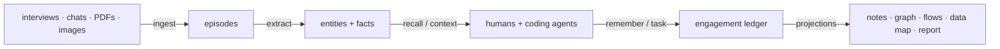

# Architecture

openfde is a local-first agent system built as a pnpm/TypeScript monorepo.
The spine is the `openfde` CLI — humans and coding agents drive the same
verbs; the web workspace (`openfde serve`) is an optional projection of the
same data. One SQLite ledger per engagement; no server required.



## Repository layout

```
packages/
  ontology/                 # THE single source of truth for the domain model
    src/
      entities.ts           #   entity types + trust levels
      relations.ts          #   relation types
      episodes.ts           #   ingestion unit kinds
      extraction.ts         #   LLM structured-output schemas (Zod)

  core/                     # @openfde/core — everything the CLI and UI share
    src/
      engagement/           # one local directory per customer project
        paths.ts            #   OPENFDE_HOME layout, slugs
        store.ts            #   create / list / use / resolve
      ledger/               # the memory engine
        database.ts         #   SQLite schema (episodes, entities, facts, tasks)
        ingest.ts           #   provenance-enforced episode intake (text + PDF/image pointers);
                            #   raw content is FTS-indexed at ingest, before extraction
        resolve.ts          #   two-phase writes: dedupe / supersede, never delete
        recall.ts           #   LLM-free hybrid retrieval: BM25 lexical + graph lists
                            #   fused with RRF, recency decay, superseded penalty,
                            #   per-source caps; matchingEpisodes for raw/pending content
        search.ts           #   FTS query building, CJK segmentation, stopwords
      extraction/           # ontology-constrained extractors
        extractor.ts        #   the Extractor interface
        anthropic.ts        #   Claude structured-output implementation
        mock.ts             #   offline/deterministic implementation for tests
      dispatch/             # agent-pull task coordination (Mode B)
        tasks.ts            #   task cards, state machine, audit events
        context.ts          #   context bundles: constraints + related memory
      assets/               # the asset library: files, git-ready
        store.ts            #   rubrics/prompts/eval cases/demos/playbooks/skills
      eval/                 # acceptance judging against rubric assets
        judge.ts            #   Judge interface, Claude judge, deterministic mock
      demo/                 # demo-driven deployment
        brief.ts            #   demo ammunition packs (pain, vocabulary, constraints, data)
      research/             # web research for methods
        web.ts              #   Claude server-side web search, cited findings
      interview/            # dot-line-plane interview guides from graph gaps
        guide.ts            #   top-down (value->flows->points) and bottom-up (mining leads)
      projections/          # markdown views of the ledger (shared by webui & export)
        notes.ts            #   tree + entity/episode/task notes, [[wiki-links]]
        datamap.ts          #   the data negotiation map (owners / trust / dependents)
        flows.ts            #   auto-extracted mermaid flow diagrams (goals/steps/blockers)
        whoknows.ts         #   "who is the expert in Y" — evidence-cited people ranking
      pages/                # free-form markdown documents next to the ledger
        store.ts            #   create/list/read/write/delete; block-edited in the webui
      canvas/               # free-form spatial cards per engagement
        store.ts            #   canvas.json read/write; drag-edited in the webui
      report/               # executive projections
        build.ts            #   derive the four boss questions from the ledger
        markdown.ts         #   markdown rendering
    test/                   # vitest suites, one per module (helpers.ts shared)

  webui/                    # @openfde/webui — the optional local workspace
    src/
      server.ts             #   node:http API + routes (launched by `openfde serve`);
                            #   /api/view mirrors CLI projections (interview, datamap,
                            #   assets, flows); /api/page|canvas|task mirror the
                            #   corresponding CLI verbs
      report-page.ts        #   printable executive report page
      index.html            #   zero-dependency workspace UI, four tabs:
                            #   Note (markdown notes + views + Notion-style block
                            #   editor with slash menu), Ontology (layered entity
                            #   graph), Todo (kanban over the task state machine),
                            #   Canvas (free-form cards); built-in mermaid renderer

skills/
  openfde/                  # the agent skill: install + operate the CLI
    SKILL.md                #   humans use the webui; agents use this

apps/
  cli/                      # the `openfde` command
    src/
      index.ts              #   thin assembler; registers commands
      commands/             #   one file per verb (engagement, ingest, extract,
                            #   recall, remember, task, context, report, status, serve)
      lib/helpers.ts        #   fail / withLedger / actorName
```

## Where future work lands

| Planned module | Home | Notes |
| --- | --- | --- |
| Ingestion connectors (Slack/Teams exports) | `packages/core/src/ingestion/` | parsers normalize sources into `IngestInput`; PDFs/images already ship via Claude-native blocks; MinerU stays an isolated external service |
| Asset promotion (engagement → team repo) | `packages/core/src/assets/` | shipped per-engagement; promotion goes behind a desensitization gate + cross-engagement leverage metrics |
| Eval backends (Langfuse sync) | `packages/core/src/eval/` | judging shipped; optional observability backend remains |
| Orchestrated dispatch runner (Mode A) | `packages/core/src/dispatch/runner/` | optional daemon spawning agents on `ready` tasks in git worktrees; same task table |
| Vault export of markdown notes | `apps/cli/src/commands/export.ts` | reuse `core/src/projections/` |
| Embedding recall (sqlite-vec) | `packages/core/src/ledger/` | slots into `recall.ts` as one more ranked list in the RRF fusion — catches paraphrase the lexical lists miss; interface unchanged |
| Answer synthesis (`openfde ask`) | `apps/cli/src/commands/ask.ts` | planner → parallel retrieval fan-out → cited synthesis; LLM stays at the answer layer, retrieval primitives stay LLM-free |

## Invariants worth keeping

1. **Ontology has one home.** Entity/relation types exist only in `packages/ontology`.
2. **Provenance is a schema constraint.** Nothing enters the ledger without a `source_uri`; every projection carries citations.
3. **Facts supersede, never delete.** Bi-temporal columns power handoff timelines and audits.
4. **No LLM on the read path.** Recall, context bundles, notes, and reports are deterministic ledger projections; LLMs act only on the write path, constrained by the ontology.
5. **The CLI is the API; the webui is its mirror.** Anything an agent needs must be reachable as a CLI verb with `--json` (taught via `skills/openfde/SKILL.md`); every CLI read-surface has a webui projection for humans, and the webui never grows capabilities the CLI lacks.
6. **Engagements are directories.** Isolation, handoff, backup, and deletion are filesystem operations.
