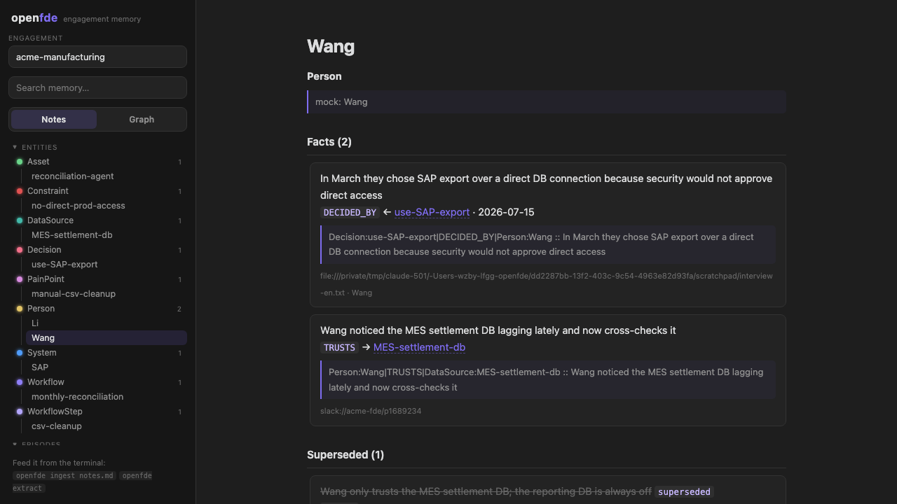
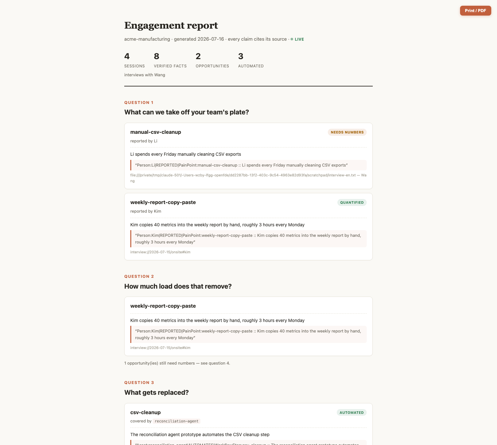

# OpenFDE: AI workspace for FDEs

[English](./README.md) | [简体中文](./README.zh-CN.md) | **日本語** | [Español](./README.es.md)

> 顧客インタビューをメモリに、メモリを追跡可能なタスクに、タスクを coding agent の仕事に——eval がゲートする。

**OpenFDE** は FDE（Forward Deployed Engineer）のためのローカルファーストな AI ワークスペースです。エンゲージメント資料——インタビュー、チャットログ、ドキュメント、PDF、画像——をオントロジーに支えられた運用メモリへとコンパイルし、人間と coding agent のループを閉じます：agent は ledger からタスクとコンテキストパックを取得し、実行し、発見を書き戻します——顧客の経営層は進捗をリアルタイムで見られ、すべての主張に出典がつきます。



## なぜ必要か

FDE の作業状態は、3 つの壊れやすい場所に散らばっています：

- **知識は会話の中にある。** 誰がどのデータソースを信頼しているか、なぜその決定がなされたか、どの制約がワークフローを塞いでいるか——会議で一度語られ、2 週間後には失われます。
- **タスクは頭の中にある。** 「インタビューで聞いた」から「coding agent に依頼した」までの間に、システムも、コンテキストも、出典への追跡もありません。
- **検収は感覚の中にある。** Agent の成果物は eval ではなく雰囲気で受け入れられています。

OpenFDE はこの 3 つを 1 つのシステムに変えます。まずはメモリから。

## OpenFDE は何をするか

- **オントロジーに支えられた運用メモリ（ontology-backed operational memory）。** 固定された FDE ドメインオントロジー——目標、業務フロー、意思決定、制約、データソース、ペインポイント——が抽出を制約し、ledger に入るのは散文ではなく運用知識です。点・線・面のレンズ（価値の面 → 業務フロー → 意思決定点）が、経営層の思考様式でメモリを整理します。
- **出典を強制するコンテキスト管理（context management）。** Agent が何を読めるかについて、完全な権限と可視性を保持します：エンゲージメント単位の分離、原文引用つきのファクト、常に制約から始まるコンテキストパック。
- **クローズドループの agent 運用（closed-loop operation）。** Coding agent は同じ CLI でタスクを取得し、コンテキストを引き出し、実行し、結果を書き戻します——ある操作の出力が次の操作の入力になる継続的なフィードバックループ（メモリ → タスク → 発見 → メモリ）。何も静かに着地しません：作業はレビュー可能な状態遷移として、完全な監査証跡とともに返ってきます。
- **ヒューマン・イン・ザ・ループのレビューとガバナンス（human-in-the-loop review）。** タスク状態機械が受け入れをゲートし、共有は能力スコープの読み取り専用。eval ゲートの受け入れ——バージョン管理されたアセットとしてのルーブリック——はロードマップにあります。

## ケイパビリティ

- **ローカルファースト。** エンゲージメントごとに 1 つの SQLite ディレクトリ（`~/.openfde/engagements/<slug>/`）。顧客データはマシンの外に出ません。引き継ぎはディレクトリの受け渡しです。
- **出典は強制、推奨ではない。** ソース URI のないコンテンツは書き込み時に拒否されます。検索されたすべてのファクトは、元の逐語的な引用まで展開できます。
- **バイテンポラルなメモリ。** 矛盾するファクトは削除ではなく無効化で置き換えます。`recall --mode handoff` はタイムラインを再生します——当時何を信じていたか、何がそれを置き換えたかを含めて。
- **読み取りパスに LLM なし。** 全文検索（CJK 対応の文字分割つき）と 1 ホップのグラフ展開で、ミリ秒単位の応答。LLM は書き込み側でのみ、固定ドメインオントロジーの制約下で動作します。
- **Agent ネイティブ。** すべてのコマンドが `--json` に対応。Agent の指示に数行加えるだけで、メモリ検索・タスク取得・発見の書き戻しができます。
- **FDE ムーブメントのフィールドツールキット。** 出典つき Web リサーチ（`research`）、翌日のデモブリーフ（`demo`）、ルーブリック受け入れ判定（`eval`）、git 対応アセットライブラリ（`asset`）、データ交渉マップ（`datamap`）。
- **追跡可能なタスク（agent-pull ディスパッチ）。** タスクカードは ledger 内にあり、状態機械と監査ログつき。`openfde context <task>` が弾薬パックを組み立てます——制約が先頭、関連メモリが続き、すべて引用つき。
- **Markdown ファーストの Obsidian スタイル・ワークスペース。** `openfde serve` で開くローカル UI では、すべてのエンティティ、エピソード、タスクが Markdown ノートです——階層ツリー、エンティティ間の [[wiki リンク]]、インラインの引用。力学グラフはコンパニオンビュー（ノードをクリックするとノートが開きます）。
- **顧客の上司向けエグゼクティブ・レポート——ライブ。** `/report` はグラフから 4 つの問いに答える、明るく印刷可能なページを描画します：何を引き受けられるか、負荷はどれだけ減るか、何が置き換わるか、価値はいくらか——数字が欠けている箇所には定量化質問を自動生成。`openfde share` で読み取り専用の LAN リンクを配布でき、agent の作業に合わせてリアルタイム更新、ライブ進捗フィードつき。

  

## クイックスタート

```sh
pnpm install

# 1. メモリ：インタビューを入れ、引用つきファクトを出す
pnpm openfde engagement create "acme corp"
pnpm openfde ingest ./notes/interview.md --kind message --speaker 田中
pnpm openfde extract               # ANTHROPIC_API_KEY が必要；オフラインは --mock
pnpm openfde recall 照合
pnpm openfde recall データソース --mode handoff   # 無効化済みファクトを含むタイムライン

# 2. ディスパッチ：メモリを追跡可能な仕事に
pnpm openfde task create "CSV クリーンアップの自動化" --criteria "無人で実行" --source "interview://onsite#pain-csv"
pnpm openfde task claim <id> && pnpm openfde context <id>   # agent が開始前に実行する 2 ステップ

# 3. 上司に見せる
pnpm openfde report                # Markdown を標準出力へ
pnpm openfde serve                 # ワークスペースは :4517、印刷可能レポートは /report
```

## CLI

| コマンド | 説明 |
| --- | --- |
| `openfde engagement create/list/use` | エンゲージメント管理（顧客プロジェクトごとに 1 ディレクトリ） |
| `openfde ingest <files…>` | 資料をエピソードとして取り込み（出典必須）——テキスト、Markdown、**PDF・画像**（Claude ネイティブで抽出） |
| `openfde extract` | オントロジー制約つき抽出 + 2 段階解決（重複排除 / 無効化置換） |
| `openfde recall <query>` | メモリ検索；`--mode handoff` でタイムライン；`--json` は agent 向け |
| `openfde remember <fact> --source <uri>` | タスク中に発見した知識を記録（agent の書き戻し） |
| `openfde task create/list/claim/start/done/accept` | 追跡可能なタスクカード：状態機械 + 監査イベントログ（agent-pull ディスパッチ） |
| `openfde context <task>` | タスク用のメモリ弾薬パックを組み立て：制約 + 関連ファクト、すべて引用つき |
| `openfde status` | 現在のエンゲージメントのメモリ概況 |
| `openfde research <query>` | 手法・実践を Web 検索（出典つき）；`--save` で発見をメモリに取り込み |
| `openfde demo <topic>` | メモリから demo ブリーフを組み立て——顧客の痛み、語彙、制約、データ形状を coding agent へ（「デモこそが営業」） |
| `openfde eval <task> --input <file>` | タスクのルーブリックに照らして成果物を判定；裁定は監査ログに残り、eval データセットが育つ |
| `openfde asset add/list/show` | アセットライブラリ：ルーブリック（タスク作成時に自動生成）、プロンプト、eval ケース、デモ、プレイブック、スキル——ファイル形式、git 対応 |
| `openfde datamap` | データ交渉マップ：各データソースを誰が所有し、誰が信頼し、何が依存しているか |
| `openfde interview` | グラフのギャップからインタビューガイドを生成——トップダウン（価値→業務フロー→意思決定点、上司セッション）またはボトムアップ（知識発掘のリード） |
| `openfde report` | 経営層向けエンゲージメント・レポート：機会、負荷軽減、自動化カバレッジ、価値——すべての主張に引用つき |
| `openfde serve` | ローカルのノート + グラフ・ワークスペース。印刷可能な経営層向けレポート `/report` も提供（任意のデーモン。CLI は単体で動作） |
| `openfde share` | 推測不可能なリンクで LAN 上にライブの読み取り専用レポートを共有——上司がリアルタイムで進捗を見られます；それ以外はループバック限定のまま |

## Agent 連携

`CLAUDE.md` / `AGENTS.md` に追加：

```
顧客エンゲージメント・メモリの検索: `openfde recall <query> --json`
タスクの取得: `openfde task list --status ready --json` →
`openfde task claim <id>`、開始前に `openfde context <id>`
新しい発見の記録: `openfde remember "<fact>" --source <uri>`
進捗報告: `openfde task update <id> --note "..."`、完了: `openfde task done <id>`
```

これだけです。シェルを実行できる agent なら何でも FDE メモリを使えます。プロトコル層も設定も不要です。

## リポジトリ構成

```
packages/ontology   FDE ドメインオントロジー（Zod、単一の情報源）
packages/core       Ledger：エンゲージメント / メモリ / ディスパッチ / プロジェクション / レポート
packages/webui      任意のローカルワークスペース（ノート + グラフ + 経営層向けレポート）
apps/cli            openfde コマンド（人間と agent の共通エントリポイント）
```

モジュールマップと今後の作業の配置は [ARCHITECTURE.md](./ARCHITECTURE.md)（英語）を参照。

## 開発

```sh
pnpm test                 # vitest
pnpm typecheck
pnpm -C apps/cli build    # ワークスペース UI を含む CLI のバンドル
```

## ロードマップ

- **Dispatch の orchestrated モード** —— agent-pull は提供済み（`openfde task` + `openfde context`）。次は `ready` タスクに対して隔離 git worktree で agent を自動起動する任意の runner
- **アセット昇格とレバレッジ指標** —— エンゲージメント単位のライブラリは提供済み（タスク基準からルーブリック自動生成、eval ケースデータセット、デモブリーフ）。次：匿名化してチームリポジトリへ昇格 + エンゲージメント横断のレバレッジ指標（契約額の上昇、デプロイあたり工数の低下）
- **オペレーショナルな書き戻し** —— 今日は意思決定リネージを記録（`task accept --outcome`）；明日は顧客システムへのアクションループを閉じる
