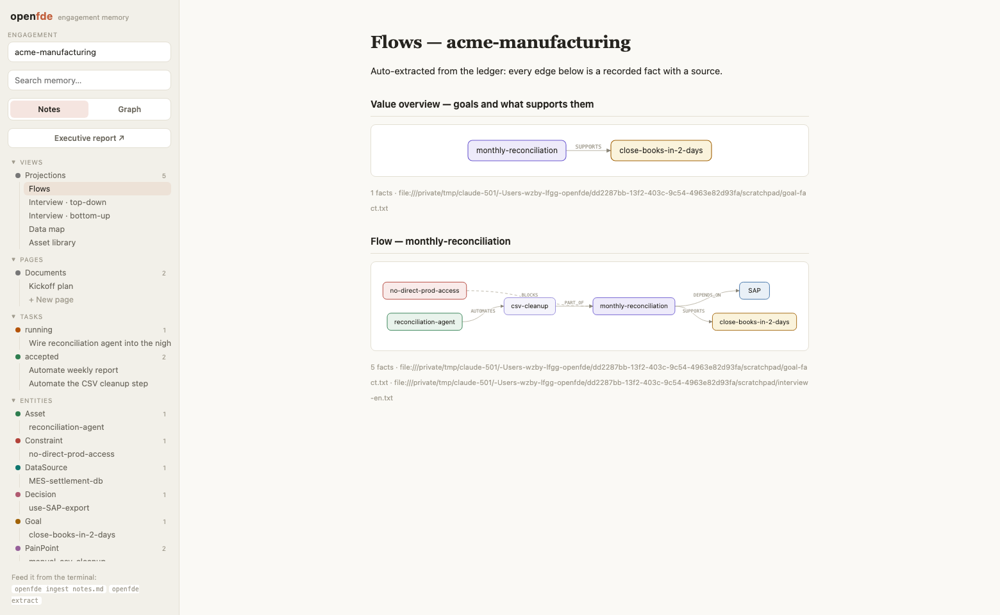

# OpenFDE: AI workspace for FDEs

**English** | [简体中文](./README.zh-CN.md) | [日本語](./README.ja.md) | [Español](./README.es.md)

> **Deliver AI solutions 100x faster.** Interviews become memory, memory becomes traceable todos, todos become coding-agent work — gated by evals.

**OpenFDE** is a local-first AI workspace for forward deployed engineers. It compiles engagement material — interviews, chat logs, documents, PDFs, images — into an ontology-backed operational memory, and closes the loop between humans and coding agents: agents pull tasks and context bundles from the ledger, execute, and write findings back — while the customer's leadership watches progress live, with every claim citing its source.


## Why

An FDE's working state lives in three fragile places:

- **Knowledge lives in conversations.** Who trusts which data source, why a decision was made, which constraint blocks a workflow — said once in a meeting, lost two weeks later.
- **Tasks live in heads.** The gap between "heard it in an interview" and "dispatched it to a coding agent" has no system, no context, no trail back to the source.
- **Verification lives in feelings.** Agent output gets accepted by vibes instead of evals.

OpenFDE turns all three into one system, starting with memory.

## What OpenFDE does

- **Ontology-backed operational memory.** A fixed FDE domain ontology — goals, workflows, decisions, constraints, data sources, pain points — constrains extraction, so what enters the ledger is operational knowledge, not prose. A dot-line-plane lens (value planes → business flows → decision points) organizes it the way leadership thinks.
- **Context management with enforced provenance.** You keep complete authority and visibility over what agents read: engagement-scoped isolation, source-cited facts, and context bundles that always lead with constraints.
- **Closed-loop agent operation.** Coding agents claim tasks, pull context, execute, and write results back through the same CLI — a continuous feedback loop where the output of one operation becomes the input of the next (memory → tasks → findings → memory). Nothing lands silently: work returns as reviewable state transitions with a full audit trail.
- **Human-in-the-loop review and governance.** A task state machine gates acceptance; sharing is capability-scoped and read-only; eval-gated acceptance — rubrics as versioned assets — is on the roadmap.

## Capabilities

- **Local-first.** One SQLite directory per engagement (`~/.openfde/engagements/<slug>/`). Customer data never leaves your machine; handing off an engagement means handing over a directory.
- **Provenance is enforced, not encouraged.** Content without a source URI is rejected at write time. Every recalled fact expands to the verbatim quote it came from.
- **Bi-temporal memory.** Contradicting facts supersede rather than delete. `recall --mode handoff` replays the timeline — including what you believed before and what replaced it.
- **No LLM on the read path.** Full-text search (with CJK-aware segmentation) plus one-hop graph expansion, in milliseconds. The LLM only works on the write path, constrained by a fixed domain ontology.
- **Agent-native.** Every command supports `--json`. Add a few lines to your agent's instructions and it can query memory, claim tasks, and write findings back mid-task.
- **A field toolkit for the FDE motion.** Web research with citations (`research`), next-day demo briefs (`demo`), rubric-based acceptance judging (`eval`), a git-ready asset library (`asset`), and a data negotiation map (`datamap`).
- **Traceable tasks (agent-pull dispatch).** Task cards live in the ledger with a state machine and an audit trail; `openfde context <task>` assembles the ammunition pack — constraints first, related memory after, everything cited.
- **A markdown-first, Obsidian-style workspace with four tabs.** `openfde serve` opens a local UI: **Note** (every entity, episode, and task as a markdown note — hierarchy tree, [[wiki-links]], citations inline, plus Views mirroring the CLI projections), **Ontology** (the entity graph in a deterministic layered layout), **Todo** (a kanban over the task state machine — drag a card to transition it, illegal moves rejected), and **Canvas** (free-form markdown cards for the thinking that precedes structure). Humans get the workspace; agents get the CLI.
- **Auto-extracted flow diagrams.** `openfde flows` turns workflow facts into mermaid flowcharts — goals, steps, dependencies, blocking constraints, and what already automates them — rendered inline in the workspace (and on GitHub), every edge backed by a cited fact. Prose explains entities; flows explain the process.

  

- **Notion-style pages.** Free-form markdown documents living next to the ledger, block-edited in the workspace — click to edit, `/` to insert headings, lists, code, mermaid diagrams, or new pages — and readable/writable by agents via `openfde page`.
- **An executive report for the customer's boss — live.** `/report` renders a light, printable page answering four questions from the graph: what we can take over, how much load it removes, what gets replaced, and what it's worth — with quantification questions auto-generated where the numbers are still missing. `openfde share` hands out a read-only LAN link that updates in real time as agents work, including a live progress feed.

  

## Quickstart

```sh
pnpm install

# 1. memory: interviews in, cited facts out
pnpm openfde engagement create "acme corp"
pnpm openfde ingest ./notes/interview.md --kind message --speaker Wang
pnpm openfde extract                        # needs ANTHROPIC_API_KEY; --mock for offline
pnpm openfde recall reconciliation
pnpm openfde recall "data source" --mode handoff   # timeline incl. superseded facts

# 2. dispatch: memory into traceable work
pnpm openfde task create "Automate the CSV cleanup" --criteria "Runs unattended" \
  --source "interview://onsite#pain-csv"
pnpm openfde task claim <id> && pnpm openfde context <id>   # what an agent runs before starting

# 3. show the boss
pnpm openfde report                         # markdown to stdout
pnpm openfde serve                          # workspace at :4517, printable report at /report
```

## CLI

| Command | What it does |
| --- | --- |
| `openfde engagement create/list/use` | Manage engagements (one local directory per customer project) |
| `openfde ingest <files…>` | Ingest material as episodes, with mandatory provenance — text, markdown, **PDFs and images** (extracted via Claude natively) |
| `openfde extract` | Ontology-constrained extraction + two-phase resolution (dedupe / supersede) |
| `openfde recall <query>` | Search memory; `--mode handoff` for the timeline view; `--json` for agents |
| `openfde remember <fact> --source <uri>` | Record knowledge discovered mid-task (agent write-back) |
| `openfde task create/list/claim/start/done/accept` | Traceable task cards with a state machine and audit trail (agent-pull dispatch) |
| `openfde context <task>` | Assemble the memory ammunition pack for a task: constraints + related facts, all cited |
| `openfde research <query>` | Web-search for methods with cited sources; `--save` ingests findings into memory |
| `openfde demo <topic>` | Demo brief from memory — the customer's pain, vocabulary, constraints, and data shapes, ready for a coding agent ("the demo is the sales pitch") |
| `openfde eval <task> --input <file>` | Judge submitted work against the task's rubric; verdicts land in the audit trail and grow the eval dataset |
| `openfde asset add/list/show` | The asset library: rubrics (auto-created from task criteria), prompts, eval cases, demos, playbooks, skills — files, git-ready |
| `openfde datamap` | The data negotiation map: who owns each data source, who trusts it, what depends on it |
| `openfde canvas show/add` | The free-form card canvas of the engagement (drag-edited in the webui's Canvas tab) |
| `openfde flows` | Auto-extracted mermaid flow diagrams: goals, workflows, steps, blockers, automation — every edge a cited fact |
| `openfde page add/list/show/edit/remove` | Free-form markdown pages next to the ledger; block-edited in the workspace, scriptable for agents |
| `openfde interview` | Interview guide generated from graph gaps — top-down (value → flows → points, the boss session) or bottom-up (knowledge-mining leads) |
| `openfde report` | Executive engagement report: opportunities, load relief, automation coverage, value — every claim cited |
| `openfde status` | Memory overview for the current engagement |
| `openfde serve` | Local notes + graph workspace, plus a printable executive report at `/report` (optional daemon — the CLI works without it) |
| `openfde share` | Share a live, read-only executive report on your LAN via an unguessable link — the boss watches progress in real time; everything else stays loopback-only |

## Agent integration

Humans use the web workspace; **agents use the CLI, taught as a skill**. Install the bundled skill into your agent:

```sh
cp -r skills/openfde ~/.claude/skills/openfde     # user scope
# or: cp -r skills/openfde .claude/skills/openfde  # project scope
```

[`skills/openfde/SKILL.md`](./skills/openfde/SKILL.md) covers installation of the CLI itself and the full operating loop (find work → claim → context → execute → write back → eval). Any agent that can run shell commands can use it — no protocol layer, no configuration.

## Repository layout

```
packages/ontology   FDE domain ontology (Zod, single source of truth)
packages/core       Ledger: engagements / memory / dispatch / projections / reports
packages/webui      Optional local workspace (notes + graph + views + executive report)
skills/openfde      The agent skill: how to install and operate the CLI
apps/cli            The openfde command (shared entry point for humans and agents)
```

See [ARCHITECTURE.md](./ARCHITECTURE.md) for the module map and where future work lands.

## Development

```sh
pnpm test                 # vitest
pnpm typecheck
pnpm -C apps/cli build    # bundle the CLI with the workspace UI
```

## Roadmap

- **Dispatch, orchestrated mode** — agent-pull shipped (`openfde task` + `openfde context`); next is an optional runner that auto-spawns agents on `ready` tasks in isolated git worktrees
- **Asset promotion & leverage metrics** — the per-engagement library shipped (rubrics from task criteria, eval case datasets, demo briefs); next: desensitized promotion to a team repo and cross-engagement leverage metrics (contract size up, per-deploy effort down)
- **Operational write-back** — record decision lineage today (`task accept --outcome`); tomorrow, close the action loop into customer systems
