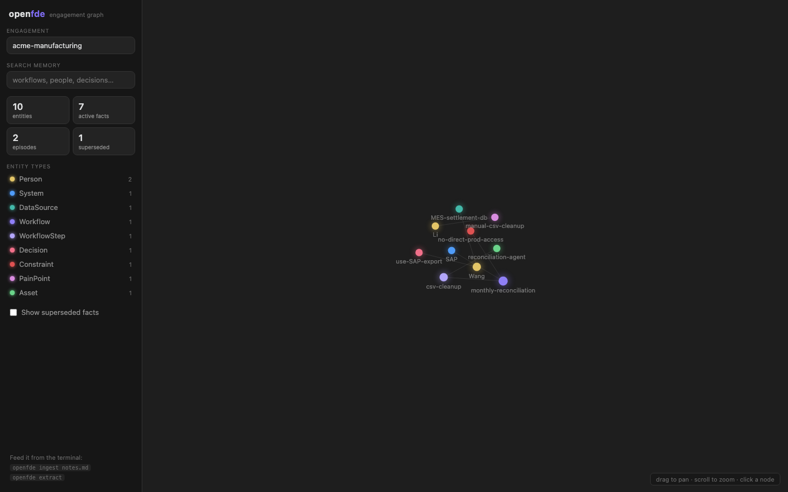

# openfde

**English** | [简体中文](./README.zh-CN.md) | [日本語](./README.ja.md) | [Español](./README.es.md)

> Turn customer interviews into memory, memory into traceable todos, todos into coding-agent work — gated by evals.

**openfde** is a local-first engagement memory system for forward deployed engineers (FDEs). Drop in interview notes, chat logs, and documents; it extracts them into a structured, citable, time-aware knowledge graph — and both you and your coding agents query it through the same CLI.


## Why

An FDE's working state lives in three fragile places:

- **Knowledge lives in conversations.** Who trusts which data source, why a decision was made, which constraint blocks a workflow — said once in a meeting, lost two weeks later.
- **Tasks live in heads.** The gap between "heard it in an interview" and "dispatched it to a coding agent" has no system, no context, no trail back to the source.
- **Verification lives in feelings.** Agent output gets accepted by vibes instead of evals.

openfde turns all three into one system, starting with memory.

## Highlights

- **Local-first.** One SQLite directory per engagement (`~/.openfde/engagements/<slug>/`). Customer data never leaves your machine; handing off an engagement means handing over a directory.
- **Provenance is enforced, not encouraged.** Content without a source URI is rejected at write time. Every recalled fact expands to the verbatim quote it came from.
- **Bi-temporal memory.** Contradicting facts supersede rather than delete. `recall --mode handoff` replays the timeline — including what you believed before and what replaced it.
- **No LLM on the read path.** Full-text search (with CJK-aware segmentation) plus one-hop graph expansion, in milliseconds. The LLM only works on the write path, constrained by a fixed domain ontology.
- **Agent-native.** Every command supports `--json`. Add one line to your agent's instructions and it can query engagement memory mid-task.
- **A markdown-first, Obsidian-style workspace.** `openfde serve` opens a local UI where every entity and episode is a markdown note — hierarchy tree, [[wiki-links]] between entities, citations inline — with a force-directed graph as a companion view (click a node to open its note).

  

## Quickstart

```sh
pnpm install
pnpm openfde engagement create "acme corp"
pnpm openfde ingest ./notes/interview.md --kind message --speaker Wang
pnpm openfde extract               # needs ANTHROPIC_API_KEY; use --mock offline
pnpm openfde recall reconciliation
pnpm openfde recall "data source" --mode handoff   # timeline incl. superseded facts
pnpm openfde serve                 # graph UI at http://localhost:4517
```

## CLI

| Command | What it does |
| --- | --- |
| `openfde engagement create/list/use` | Manage engagements (one local directory per customer project) |
| `openfde ingest <files…>` | Ingest material as episodes, with mandatory provenance |
| `openfde extract` | Ontology-constrained extraction + two-phase resolution (dedupe / supersede) |
| `openfde recall <query>` | Search memory; `--mode handoff` for the timeline view; `--json` for agents |
| `openfde remember <fact> --source <uri>` | Record knowledge discovered mid-task (agent write-back) |
| `openfde task create/list/claim/start/done/accept` | Traceable task cards with a state machine and audit trail (agent-pull dispatch) |
| `openfde context <task>` | Assemble the memory ammunition pack for a task: constraints + related facts, all cited |
| `openfde status` | Memory overview for the current engagement |
| `openfde report` | Executive engagement report: opportunities, load relief, automation coverage, value — every claim cited |
| `openfde serve` | Local notes + graph workspace, plus a printable executive report at `/report` (optional daemon — the CLI works without it) |

## Agent integration

Add to your `CLAUDE.md` / `AGENTS.md`:

```
Query customer engagement memory with `openfde recall <query> --json`.
Pick up work: `openfde task list --status ready --json`, then
`openfde task claim <id>` and `openfde context <id>` before starting.
Record new findings with `openfde remember "<fact>" --source <uri>`.
Report progress with `openfde task update <id> --note "..."`; finish with `openfde task done <id>`.
```

That's it — any agent that can run shell commands can use FDE memory. No protocol layer, no configuration.

## Repository layout

```
packages/ontology   FDE domain ontology (Zod, single source of truth)
packages/core       Ledger: engagements / memory / dispatch / projections / reports
packages/webui      Optional local workspace (notes + graph + executive report)
apps/cli            The openfde command (shared entry point for humans and agents)
```

See [ARCHITECTURE.md](./ARCHITECTURE.md) for the module map and where future work lands.

## Development

```sh
pnpm test                 # vitest
pnpm typecheck
pnpm -C apps/cli build    # bundle the CLI with the graph UI
```

## Roadmap

- **Dispatch, orchestrated mode** — agent-pull shipped (`openfde task` + `openfde context`); next is an optional runner that auto-spawns agents on `ready` tasks in isolated git worktrees
- **Asset library with evals built in** — prompts, rubrics, and eval datasets are versioned assets; evaluation consumes rubric assets and feeds scores and new test cases back into the library
- **Asset promotion** — patterns that survive an engagement get desensitized and promoted for reuse
